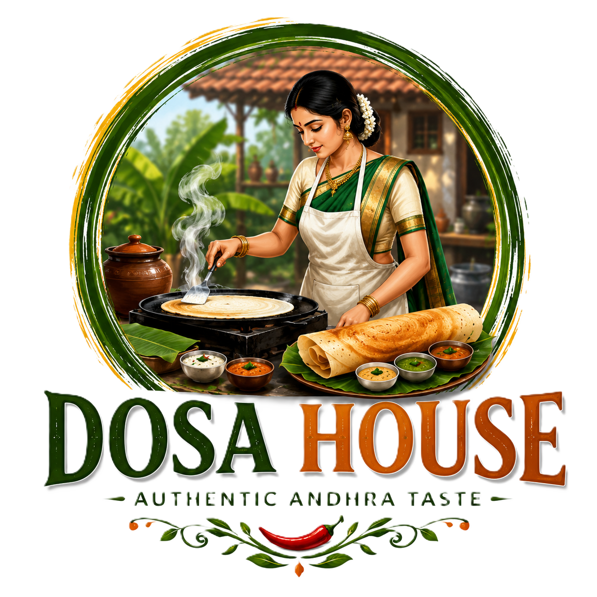

<div align="center">



# 🍛 Dosa House
### *Full-Stack Restaurant Management System*

[](https://dosa-house-7bd70.web.app)
[](https://firebase.google.com)
[](https://dosa-house-7bd70.web.app)
[](https://firebase.google.com/products/hosting)

> A production-ready, real-time restaurant platform — from customer ordering to kitchen cooking to doorstep delivery. Built with Firebase, Vanilla JS, and zero frameworks.

</div>

---

## ✨ What Makes This Special?

This isn't just a menu website. It's a **complete end-to-end restaurant ecosystem** with separate dashboards for every role — Customers, Admins, Kitchen Staff, and Delivery Partners — all syncing in real-time via Firebase.

---

## 🗺️ System Architecture

```
Customer  →  Places Order  →  Admin Dashboard  →  Kitchen Display  →  Delivery  →  OTP Confirm  →  ⭐ Review
```

| Role | Dashboard | What They Do |
|------|-----------|--------------|
| 👤 **Customer** | `index.html`, `menu.html`, `orders.html` | Browse, order, track, pay, rate |
| 🛡️ **Admin** | `admin.html` | Accept orders, manage flow, view revenue |
| 👨‍🍳 **Kitchen** | `kitchen.html` | See live tickets, mark food ready |
| 🛵 **Delivery** | `delivery.html` | Accept deliveries, confirm via OTP |

---

## 🚀 Features

### 🧑‍🍳 Customer Experience
- 🕵️ **Public browsing** — explore menu, booking & about without logging in
- 🛒 **Smart Cart** — add items, adjust quantities, auto-calculate bill
- 💳 **Dual Payment** — Cash on Delivery or UPI with dynamic QR code
- 🚚 **Real-time Order Tracking** — live progress bar (Placed ➔ Cooking ➔ On Way ➔ Delivered)
- 🔔 **Native OS Push Notifications** — meal-time based, personalized Telugu/English craving alerts (works on mobile & desktop)
- 🔑 **OTP Delivery Verification** — receive unique OTP, share with delivery partner
- 🌟 **Enhanced Reviews** — submit star ratings along with detailed text reviews directly from a modal popup
- 📅 **Table Booking** — beautiful, glassmorphic multi-step wizard to reserve a table with an interactive Material-style analog clock (supports keyboard navigation!)
- 🪙 **Dosa Coins Loyalty** — earn 5% cashback as coins on every order and redeem them during checkout
- 📸 **Profile Management** — upload and manually crop your profile picture directly in the browser
- 🔄 **Unified UI Loading** — seamless animated logo transition across all authenticated pages

### 🛡️ Admin Dashboard
- 📊 **Live Stats & Advanced Analytics** — Today's revenue, custom date ranges, pending count, avg rating
- 🔄 **Full Order Lifecycle** — Accept → Preparing → Packaging → Dispatch
- 🎯 **Smart Dispatch System** — explicitly assign accepted orders to specific Chefs, and packaging orders to specific Delivery Partners from active staff dropdowns
- 💸 **UPI Payment Verification** — manually confirm received payments
- 🔔 **New Order Sound Alert** — audio notification on new orders
- 🗂️ **Filter by Status** — tab-based view for each order stage
- ⭐ **Reviews Tab** — dedicated dashboard to read all customer ratings and feedback
- 🎟️ **Staff Invites** — generate secure invite codes to onboard Kitchen and Delivery staff

### 👨‍🍳 Kitchen Display System (KDS)
- 🎫 **Live Order Tickets** — instantly view orders explicitly assigned to you by the Admin
- ⏱️ **Priority Queue** — oldest orders shown first
- ✅ **One-tap Status Update** — Start Preparing → Mark Ready

### 🛵 Delivery Dashboard
- 📋 **Assigned Deliveries** — strictly see active trips assigned directly to your profile
- 🚀 **Accept & Dispatch** — one button to start delivery
- 🔐 **OTP Confirmation** — enter customer OTP to mark delivered

---

## 🔐 Authentication System

| Method | Who Uses It |
|--------|------------|
| 🔵 Google OAuth | Customers (one-click sign in) |
| 📧 Email + Password | Customers (sign up / sign in) |
| 🔑 Email + Password | Staff (admin / kitchen / delivery) |

- Role-based access control (RBAC) enforced at every page
- Guests can freely browse — login prompted only at checkout/booking
- Friendly login modal instead of harsh page redirects

---

## 📱 Progressive Web App (PWA)

- 📲 **Installable** on Android & iOS — works like a native app
- ⚡ **Service Worker** caching for fast repeat visits
- 📶 **Offline-friendly** — key assets cached locally
- 🎨 **Custom Launch Screen** — premium branded loading experience with logo

---

## 🗂️ Project Structure

```
Dosa House/
│
├── 📄 index.html          → Home (Hero, Reviews, CTA)
├── 📄 menu.html           → Menu + Cart + Checkout
├── 📄 booking.html        → Table Reservation
├── 📄 orders.html         → Customer Order Tracking
├── 📄 about.html          → Brand Story
├── 📄 account.html        → Profile + Notifications
├── 📄 login.html          → Auth (Google + Email + Staff)
│
├── 📄 admin.html          → 🛡️ Admin Dashboard
├── 📄 kitchen.html        → 👨‍🍳 Kitchen Display System
├── 📄 delivery.html       → 🛵 Delivery Dashboard
│
├── 📁 scripts/
│   ├── firebase-config.js → Firebase init + RBAC roles
│   ├── auth.js            → Auth helpers (setupNavAuth, requireLogin)
│   ├── main.js            → Cart, Checkout, Order Placement
│   ├── booking.js         → Table Booking logic
│   ├── kitchen.js         → KDS real-time listener
│   ├── orders.js          → Order history utilities
│   ├── reviews.js         → Review submission
│   ├── music.js           → Background music player
│   └── ui.js              → Toast, Dropdown, PWA install
│
├── 📁 styles/             → Modular CSS (main, cart, booking, etc.)
├── 📁 assets/             → Images, audio, icons
├── 📁 dist/               → Production build (deployed to Firebase)
│
├── 📄 sw.js               → Service Worker (PWA)
├── 📄 manifest.json       → PWA manifest
├── 📄 firebase.json       → Firebase Hosting config
└── 📄 scripts/build.js    → Build script (src → dist)
```

---

## 🛠️ Tech Stack

| Category | Technology |
|----------|-----------|
| **Frontend** | HTML5, CSS3, JavaScript (ES6+) |
| **Database** | Firebase Firestore (real-time) |
| **Auth** | Firebase Authentication |
| **Hosting** | Firebase Hosting |
| **PWA** | Service Workers, Web Manifest |
| **Build** | Custom Node.js build script |
| **Version Control** | Git & GitHub |


## 🔄 Order Flow (Complete)

```
1. Customer browses menu (no login needed)
2. Customer adds items to cart
3. Customer clicks Checkout → Login prompt if not signed in
4. Customer enters address + payment method → Places Order
5. Admin sees new order (with sound alert) → Accepts it
6. Kitchen sees ticket → Starts preparing → Marks Ready
7. Admin sends to Delivery → OTP generated & shown to customer
8. Delivery partner accepts → Picks up → Delivers
9. Delivery partner asks for customer OTP → Enters it → Confirmed ✅
10. Customer rates the experience ⭐
```

---

## 🎨 Design System

Inspired by authentic South Indian culture:

| Token | Color | Usage |
|-------|-------|-------|
| Saffron Orange | `#F57F17` | Primary CTA, accents |
| Banana Leaf | `#2E7D32` | Success, nature elements |
| Sambar Brown | `#3E2723` | Text, headings |
| Cream White | `#FFF8E1` | Backgrounds |
| Clay Red | `#E65100` | Alerts, highlights |

---

<div align="center">

**Built with ❤️ and a lot of Masala Dosa 🍛**

*MohanAbhishek29 — Cloud Computing & Full-Stack Developer*

[](https://github.com/MohanAbhishek29)

</div>
