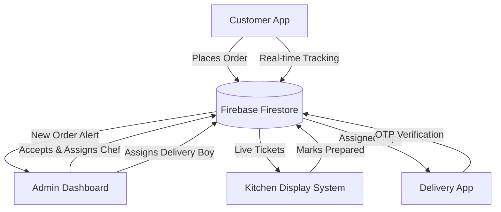

<div align="center">


# 🍛 Dosa House
### *Full-Stack Restaurant Management System*

[](https://dosa-house-7bd70.web.app)
[](https://firebase.google.com)
[](https://dosa-house-7bd70.web.app)
[](https://firebase.google.com/products/hosting)

> A production-ready, real-time restaurant platform — from customer ordering to kitchen cooking to doorstep delivery. Built with Firebase, Vanilla JS, and zero frameworks.

</div>

---

## ✨ What Makes This Special?

This isn't just a menu website. It's a **complete end-to-end restaurant ecosystem** with separate dashboards for every role — Customers, Admins, Kitchen Staff, and Delivery Partners — all syncing in real-time via Firebase.

---

## 🗺️ System Architecture

The entire ecosystem is deeply integrated with **Firebase Firestore**, leveraging real-time `onSnapshot` listeners to instantly push updates to all active clients without manual polling.



| Role | Dashboard | What They Do |
|------|-----------|--------------|
| 👤 **Customer** | `index.html`, `menu.html`, `orders.html` | Browse, order, track, pay, rate |
| 🛡️ **Admin** | `admin.html` | Accept orders, manage flow, view revenue |
| 👨‍🍳 **Kitchen** | `kitchen.html` | See live tickets, mark food ready |
| 🛵 **Delivery** | `delivery.html` | Accept deliveries, confirm via OTP |

---

## 🚀 Features

### 🧑‍🍳 Customer Experience
- 🕵️ **Public browsing** — explore menu, booking & about without logging in
- 🛒 **Smart Cart** — add items, adjust quantities, auto-calculate bill
- 💳 **Dual Payment** — Cash on Delivery or UPI with dynamic QR code
- 🚚 **Real-time Order Tracking** — live progress bar (Placed ➔ Cooking ➔ On Way ➔ Delivered)
- 🔔 **Native OS Push Notifications** — meal-time based, personalized Telugu/English craving alerts (works on mobile & desktop)
- 🔑 **OTP Delivery Verification** — receive unique OTP, share with delivery partner
- 🌟 **Enhanced Reviews** — submit star ratings along with detailed text reviews directly from a modal popup
- 📅 **Table Booking** — beautiful, glassmorphic multi-step wizard to reserve a table with an interactive Material-style analog clock (supports keyboard navigation!)
- 🪙 **Dosa Coins Loyalty** — earn 5% cashback as coins on every order and redeem them during checkout
- 🎵 **Ambient Background Music** — fully custom Steam-style UI music player that persists track state seamlessly across page navigations
- 🧾 **Digital Receipts** — beautiful, dynamic CSS-styled receipts generated for completed orders
- 🍽️ **Dine-In Workflow** — bypass delivery fees and explicitly order to a specific Table Number from inside the restaurant
- 📸 **Profile Management** — upload and manually crop your profile picture directly in the browser
- 🔄 **Unified UI Loading** — seamless animated logo transition across all authenticated pages
- 💎 **Premium Glassmorphism UI** — semi-transparent glass cards with blur effects for food items and booking forms
- 📱 **Fully Mobile Responsive** — fluid grid layouts, stacked components, horizontal scrolling, and a native-like slide-out hamburger menu for flawless mobile viewing

### 🛡️ Admin Dashboard
- 📊 **Live Stats & Advanced Analytics** — Today's revenue, custom date ranges, pending count, avg rating
- 🔄 **Full Order Lifecycle** — Accept → Preparing → Packaging → Dispatch
- 🎯 **Smart Dispatch System** — explicitly assign accepted orders to specific Chefs, and packaging orders to specific Delivery Partners from active staff dropdowns
- 💸 **UPI Payment Verification** — manually confirm received payments
- 🔔 **New Order Sound Alert** — audio notification on new orders
- 🗂️ **Filter by Status** — tab-based view for each order stage, including a unified "Completed" view that gracefully merges Takeaway "delivered" and Dine-In "served" states
- ⭐ **Reviews Tab** — dedicated dashboard to read all customer ratings and feedback
- 📅 **Live Table Bookings** — new dedicated tab to monitor today's active table reservations and manually free up tables
- 🛑 **Emergency Close** — one-click toggle to instantly freeze all customer checkouts and bookings with a global "We are closed" alert
- 👥 **Staff Role Management** — view all registered users and directly assign them "Kitchen" or "Delivery" roles right from the dashboard (no invite codes needed)
- 📅 **Advanced Date Analytics** — track total revenue, order volume, and delivery staff performance by Today, This Week, This Month, or custom date ranges
- 📡 **Offline-Robust Queries** — orders are fetched raw and sorted client-side to prevent Firestore from dropping orders with pending/null timestamps during network drops

### 👨‍🍳 Kitchen Display System (KDS)
- 🎫 **Live Order Tickets** — instantly view orders explicitly assigned to you by the Admin
- ⏱️ **Priority Queue** — oldest orders shown first
- ✅ **One-tap Status Update** — Start Preparing → Mark Ready

### 🛵 Delivery Dashboard
- 📋 **Assigned Deliveries** — strictly see active trips assigned directly to your profile
- 🚀 **Accept & Dispatch** — one button to start delivery
- 🔐 **OTP Confirmation** — enter customer OTP to mark delivered

---

## 🔐 Authentication System

| Method | Who Uses It |
|--------|------------|
| 🔵 Google OAuth | Customers (one-click sign in) |
| 📧 Email + Password | Customers (sign up / sign in) |
| 🔑 Email + Password | Staff (admin / kitchen / delivery) |

- Role-based access control (RBAC) enforced at every page
- Guests can freely browse — login prompted only at checkout/booking
- Friendly login modal instead of harsh page redirects

---

## 📱 Progressive Web App (PWA)

Built to feel indistinguishable from a native mobile application.
- 📲 **Fully Installable** — Adds an app icon directly to your Android or iOS home screen via `manifest.json`.
- ⚡ **Service Worker Caching** — A custom `sw.js` heavily caches all images, CSS, and fonts, resulting in near-instant load times on repeat visits.
- 📶 **Offline-Friendly UI** — Key static assets remain accessible even during network drops.
- 🎨 **Custom Launch Screen** — Premium branded splash screen seamlessly fades into the application logo upon launch.
- 📱 **Native-Like Navigation** — Hideable URL bars, custom pull-to-refresh handling, and fluid slide-out mobile sidebars.

## 🗂️ Project Structure

```
Dosa House/
│
├── 📄 index.html          → Home (Hero, Reviews, CTA)
├── 📄 menu.html           → Menu + Cart + Checkout
├── 📄 booking.html        → Table Reservation
├── 📄 orders.html         → Customer Order Tracking
├── 📄 about.html          → Brand Story
├── 📄 account.html        → Profile + Notifications
├── 📄 login.html          → Auth (Google + Email + Staff)
│
├── 📄 admin.html          → 🛡️ Admin Dashboard
├── 📄 kitchen.html        → 👨‍🍳 Kitchen Display System
├── 📄 delivery.html       → 🛵 Delivery Dashboard
│
├── 📁 scripts/
│   ├── firebase-config.js → Firebase init + RBAC roles
│   ├── auth.js            → Auth helpers (setupNavAuth, requireLogin)
│   ├── main.js            → Cart, Checkout, Order Placement
│   ├── booking.js         → Table Booking logic
│   ├── kitchen.js         → KDS real-time listener
│   ├── orders.js          → Order history utilities
│   ├── reviews.js         → Review submission
│   ├── music.js           → Background music player
│   └── ui.js              → Toast, Dropdown, PWA install
│
├── 📁 styles/             → Modular CSS (main, cart, booking, etc.)
├── 📁 assets/             → Images, audio, icons
│
├── 📄 sw.js               → Service Worker (PWA)
├── 📄 manifest.json       → PWA manifest
├── 📄 firebase.json       → Firebase Hosting config
└── 📄 scripts/build.js    → Build script (src → dist)
```

---

## 🛠️ Tech Stack & Architecture Deep Dive

**Zero Frameworks. Pure Performance.** 
This project purposely avoids massive frameworks like React or Angular to demonstrate deep mastery of the DOM, Native Web APIs, and real-time database architecture.

| Layer | Technology | Details |
|-------|-----------|---------|
| **Frontend UI** | HTML5, CSS3, ES6+ JS | Custom glassmorphism, CSS grid/flexbox, native DOM manipulation |
| **Database** | Firebase Firestore | NoSQL structure, highly optimized `onSnapshot` real-time listeners |
| **Authentication** | Firebase Auth | Google OAuth 2.0 and Email/Password with Role-Based Access Control (RBAC) |
| **State Management** | LocalStorage & JS Objects | Persistent cart state, user session data, and background music player state |
| **PWA & Offline** | Service Workers | `sw.js` with Cache-First strategy for assets, Network-First for dynamic data |
| **Build System** | Node.js (Custom Script) | Bespoke build pipeline copying source to `dist/`, injecting environment variables |
| **Hosting** | Firebase Hosting | Secure global CDN, custom rewrite rules in `firebase.json` |

## 🔄 Order Flow (Dual Workflows)

**A. Takeaway & Delivery Workflow**
```
1. Customer clicks Checkout → login prompt if not signed in
2. Customer selects Takeaway/Delivery, enters address + payment (Cash/UPI)
3. Admin sees new order (sound alert) → Accepts it
4. Admin assigns Chef → Kitchen sees ticket → Starts cooking
5. Kitchen marks Ready → Admin assigns Delivery Boy → Dispatches
6. Delivery partner drives to location → asks for OTP
7. Partner enters OTP → Order Delivered ✅
8. Customer rates the experience ⭐ + Detailed Review
```

**B. Dine-In Workflow**
```
1. Customer seated at Table → Selects "Dine-In" at Checkout
2. Selects Table Number (e.g., Table 5) → Places Order
3. Admin accepts order → Assigns Chef
4. Kitchen marks Ready → Waiter physically serves food
5. Waiter/Admin marks order as "Served" ✅ (bypasses delivery)
```

---

## 🎨 Design System & Aesthetics

The UI breaks away from boring flat design by utilizing a highly modern, **Glassmorphism** aesthetic combined with authentic South Indian cultural themes.

| Token | Color | Usage |
|-------|-------|-------|
| **Saffron Orange** | `#F57F17` | Primary calls to action, active tabs, energetic highlights |
| **Banana Leaf** | `#2E7D32` | Success states, completed orders, vegetarian badges |
| **Sambar Brown** | `#3E2723` | Deep textual contrast, typography headers |
| **Cream White** | `#FFF8E1` | Secondary backgrounds, receipt paper simulation |
| **Clay Red** | `#E65100` | Critical alerts, emergency close banners |

### UI/UX Micro-Interactions
- **Glassmorphism Panels:** Semi-transparent cards with `backdrop-filter: blur(12px)` creating a premium frosted-glass effect over the dynamic restaurant background.
- **Steam Animations:** CSS-driven animated steam rising dynamically from hot dishes in the Kitchen Display System.
- **Pulse Glowing:** Neon-like CSS `box-shadow` animations that throb continuously to alert admins of brand new incoming orders.
- **Fluid Layouts:** Complete CSS Grid mastery ensuring the POS and KDS systems perfectly scale across massive desktop monitors down to 4-inch mobile screens without breaking.

<div align="center">

**Built with ❤️ and a lot of Masala Dosa 🍛**

*MohanAbhishek29 — Cloud Computing & Full-Stack Developer*

[](https://github.com/MohanAbhishek29)

</div>
